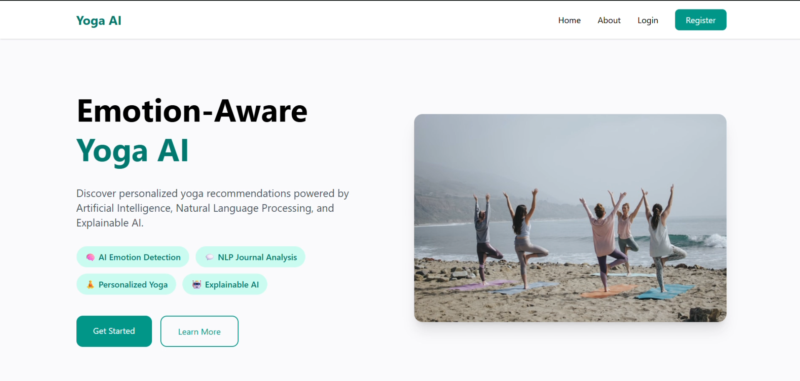
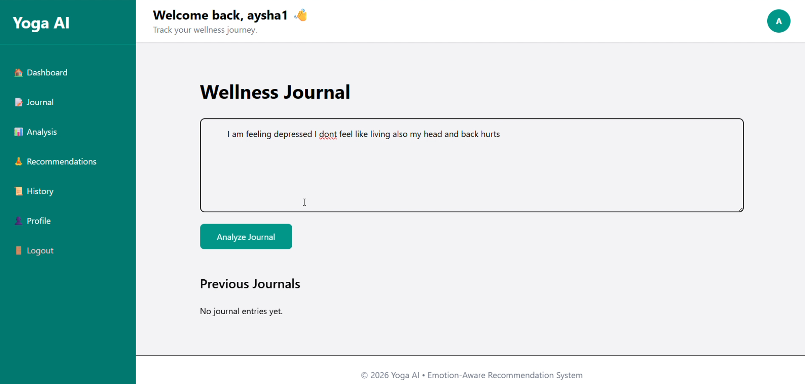
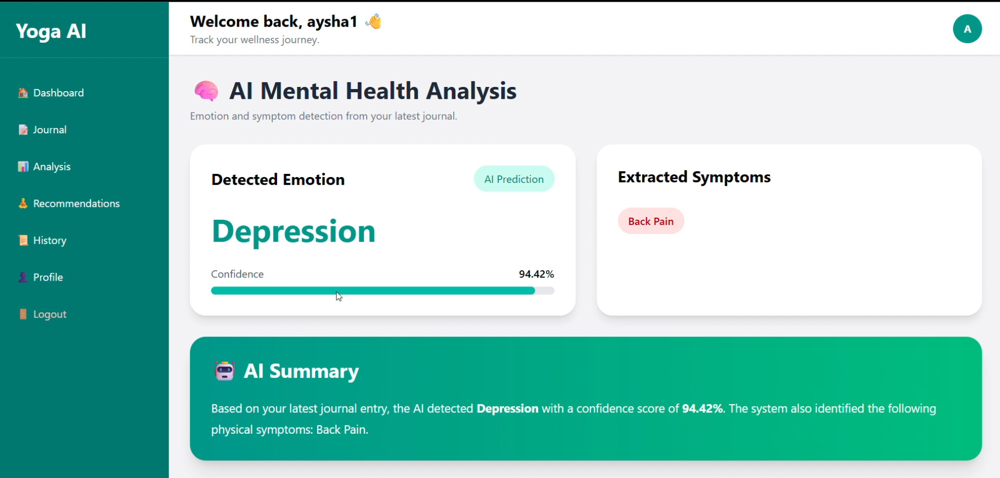
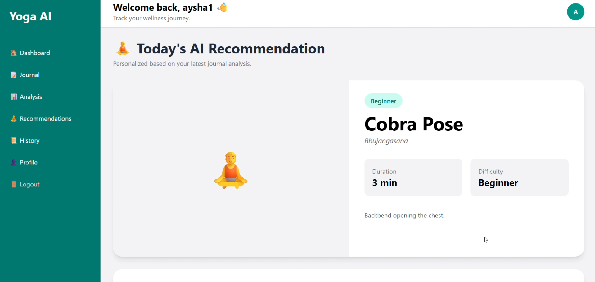

# 🧘 Emotion-Aware & Explainable Yoga Recommendation System

An AI-powered web application built with **Python**, **Django**, and **DistilBERT** that analyses users' journal entries to detect emotional states and provides personalised yoga recommendations with explainable AI.

---

## 📌 Overview

This project combines **Natural Language Processing (NLP)**, **Machine Learning**, and a **rule-based recommendation engine** to recommend yoga poses tailored to a user's emotional state. The application analyses free-text journal entries, predicts emotions using a fine-tuned DistilBERT model, extracts relevant symptoms, applies safety checks, and explains why each yoga pose is recommended.

Rather than acting as a replacement for human judgement, the system is designed to demonstrate how AI can support personalised wellness recommendations in a transparent and responsible manner.

---

## ✨ Features

- User Registration & Authentication
- User Profile Management
- Journal Entry Analysis
- Emotion Detection using DistilBERT
- NLP-based Symptom Extraction
- Personalised Yoga Recommendations
- Safety & Contraindication Filtering
- Explainable AI Recommendations
- Recommendation History
- Responsive User Interface

---

## 🧠 AI Workflow

```
User Journal Entry
        │
        ▼
Text Preprocessing
        │
        ▼
DistilBERT Emotion Classification
        │
        ▼
Symptom Extraction
        │
        ▼
Recommendation Engine
        │
        ▼
Safety Validation
        │
        ▼
Explainable AI
        │
        ▼
Recommended Yoga Poses
```

---

## 🎯 Supported Emotion Classes

- Anxiety
- Depression
- Stress
- Bipolar Disorder
- Personality Disorder
- Suicidal
- Normal

---

## 💡 Explainable AI

The system not only recommends yoga poses but also explains why each pose was selected based on:

- Detected emotion
- Identified symptoms
- Yoga pose benefits
- Safety considerations
- Contraindications

This improves transparency and helps users understand the reasoning behind every recommendation.

---

## 🛠 Tech Stack

### Backend

- Python
- Django

### Artificial Intelligence

- PyTorch
- Hugging Face Transformers
- DistilBERT

### Machine Learning & NLP

- Scikit-learn
- Pandas
- NumPy

### Frontend

- HTML
- Tailwind CSS
- JavaScript

### Database

- SQLite

---

## 📂 Project Structure

```
Emotion-Aware-Yoga-Recommendation-System
│
├── config/
├── home/
├── journal/
├── profile_app/
├── recommendations/
├── static/
├── templates/
├── training/
├── users/
├── screenshots/
├── manage.py
├── requirements.txt
└── README.md
```

---

## 🚀 Installation

Clone the repository

```bash
git clone https://github.com/AyishaBeevi/Emotion-Aware-Yoga-Recommendation-System.git
```

Move into the project directory

```bash
cd Emotion-Aware-Yoga-Recommendation-System
```

Create a virtual environment

```bash
python -m venv venv
```

Activate the virtual environment

### Windows

```bash
venv\Scripts\activate
```

### Linux/macOS

```bash
source venv/bin/activate
```

Install dependencies

```bash
pip install -r requirements.txt
```

Apply migrations

```bash
python manage.py migrate
```

Run the application

```bash
python manage.py runserver
```

---

## 📷 Application Screenshots

### Dashboard


### Home



### Journal Analysis



### Emotion Analysis



### Recommendation 



---

## 📈 Future Enhancements

- Voice Emotion Analysis
- Facial Emotion Recognition
- Meditation Recommendations
- Cloud Deployment
- Mobile Application
- Wearable Device Integration
- Multilingual Support

---

## 📚 Key Learnings

Developing this project provided practical experience with:

- Fine-tuning and integrating DistilBERT into a Django application
- Building an NLP inference pipeline
- Developing a rule-based recommendation system
- Applying Explainable AI principles
- Deploying machine learning models within a full-stack web application

One important takeaway was that **high training accuracy alone is not sufficient for real-world AI systems**. Although the model achieved approximately **96% training accuracy**, real-world predictions depend on input quality, context, and language ambiguity. AI should assist human decision-making by providing meaningful insights rather than replacing human judgement.

---

## 👩‍💻 Author

**Aysha Beevi**

Python Developer | Django Developer | Machine Learning & NLP Enthusiast

GitHub: https://github.com/AyishaBeevi

---

## 📄 License

This project is licensed under the MIT License.
